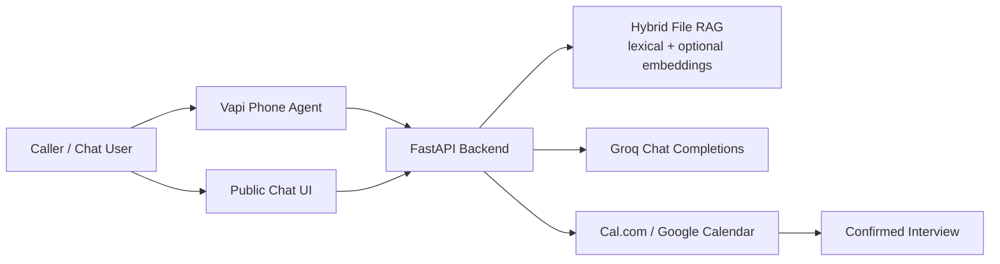

# AI Persona Interview Agent

An end-to-end Python/FastAPI AI representative for the Scaler AI Engineer screening assignment. It exposes:

- A public chat interface grounded in resume and GitHub corpus.
- Booking tools backed by a real calendar provider.
- Voice-agent tool endpoints for Vapi orchestration.
- Evaluation scripts and a one-page report generator.

## Architecture



## Quick Start

1. Create a virtual environment and install dependencies: `pip install -r requirements.txt`.
2. Copy `.env.example` to `.env` and fill in real keys.
3. Put your resume in `data/resume.md`.
4. Set `GITHUB_OWNER` and optional comma-separated `GITHUB_REPOS`.
5. Run `python scripts/ingest.py`.
6. Run `uvicorn app.main:app --reload --host 127.0.0.1 --port 8000`.
7. Open `http://localhost:8000`.

The app deliberately refuses to invent facts. If a question is not supported by retrieved resume/repo evidence, the persona says it does not know and suggests what evidence would be needed.

## Deployment

Deploy the repository to Render as a Python web service. `render.yaml` is included, and Render will run:

- Build: `pip install -r requirements.txt && python scripts/ingest.py`
- Start: `uvicorn app.main:app --host 0.0.0.0 --port $PORT`

Render is the recommended target because it gives a stable public HTTPS URL, simple environment-variable management, and predictable always-on behavior. Railway or Fly.io can use the same Uvicorn start command from `render.yaml`.

For voice, create a Vapi assistant with:

- First message: `Hi, this is Kuldeep's AI representative. I can answer questions about his background and book an interview if there is a fit.`
- Model/provider: Groq, using `llama-3.1-8b-instant` or another low-latency Groq model.
- Tools:
  - `POST /api/voice/respond`
  - `POST /api/availability`
  - `POST /api/book`

The webhook response is optimized for short spoken answers and exposes calendar booking as a tool.

## RAG Approach

`python scripts/ingest.py` reads:

- `data/resume.md`
- fetched GitHub repo metadata, READMEs, and recent commits when `GITHUB_OWNER` is configured
- any additional `.md` files placed under `data/`

The retrieval layer is a hybrid file-backed RAG index implemented in `app/rag.py`. It is designed for Render's 512 MB free instance and avoids Chroma, FAISS servers, local embedding models, LangChain, or LlamaIndex.

Ingestion does this:

- Reads resume, notes, GitHub repo metadata, READMEs, and recent commits.
- Chunks evidence by paragraph.
- Stores lexical term frequencies for exact tool/repo/date matching.
- Optionally stores OpenAI embedding vectors in `data/index.json` when `OPENAI_EMBEDDING_API_KEY` is configured.

Query-time retrieval combines:

- Lexical score for exact matches.
- Cosine similarity over stored embeddings for semantic recall.
- Top evidence chunks only are sent to Groq.

Groq is used for answer generation. OpenAI is used only for optional embeddings because Groq does not provide embedding models. If the embedding key is absent, the app still runs with lexical retrieval.

## Calendar Booking

The default adapter is Cal.com:

- `GET /api/availability?from=...&to=...`
- `POST /api/book`

Required variables:

- `CALCOM_API_KEY`
- `CALCOM_EVENT_TYPE_ID`
- `CALCOM_TIMEZONE`

Google Calendar can be added behind `app/calendar.py` without changing chat or voice flows.

## Evaluation

Run:

```bash
python scripts/eval.py
python scripts/make_report_pdf.py
```

The eval runner checks grounded answers, refusal behavior, retrieval precision, and booking flow health. Replace `evals/golden.json` with your own labelled questions before final submission.

## Cost Breakdown

Typical per interaction, assuming Groq-hosted chat completions and hosted FastAPI:

- Chat session, 8 turns: low cents depending on context size.
- Optional embedding query: one small embedding call per chat/voice turn when enabled.
- Voice minute: voice provider + transcription + LLM + TTS, usually higher than chat and dominated by realtime audio.
- Calendar booking: no marginal API cost.
- Hosting: free or low monthly tier for this traffic.

Use the provider dashboards for exact submitted costs, because voice pricing changes by model, region, and telephony provider.

## Submission Checklist

- Public chat URL live for at least 7 days.
- Phone number configured in voice provider.
- Cal.com or Google Calendar booking succeeds end to end.
- Public GitHub repository contains this README.
- `outputs/eval-report.pdf` generated and uploaded.
- Loom under 4 minutes covering architecture and one hard problem.
